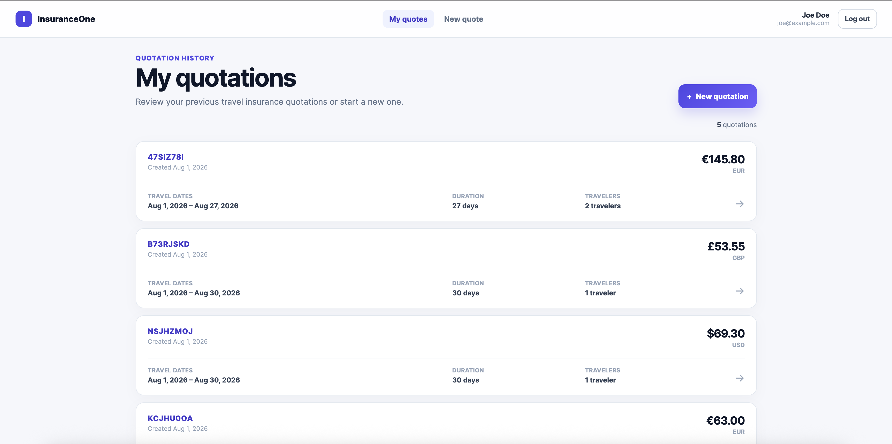

# Travel Insurance Quotation

A full-stack travel insurance quotation application built with Laravel and Angular.

Users can create an account, sign in, generate travel insurance quotations for multiple travelers, review their quotation history, and view detailed quotation results.

## Live Application

[Open the deployed application](https://travel-insurance-quotation-1.onrender.com/)

## Testing the Application

You can test the application in either of these ways:

### Option 1: Use the demonstration account

```text
Email: joe@example.com
Password: StrongPassword123!
```

### Option 2: Create your own account

Open the application and select **Create account** to register with your own name, email address, and password.

> The demonstration account is provided only for testing this project. Do not reuse these credentials for other services.

## Features

- User registration and login
- JWT-based authentication
- Protected application routes
- Creation of travel insurance quotations
- Support for multiple travelers
- Traveler age validation
- Multiple currency support
- Quotation history
- Detailed quotation results
- Responsive desktop and mobile design
- Laravel API connected to PostgreSQL
- Angular single-page application

## Application Preview



## Project Structure

```text
travel-insurance-quotation/
├── backend/         Laravel API
├── frontend/        Angular application
├── docs/
│   └── images/      Project screenshots
└── README.md
```

## Technology

### Backend

- PHP
- Laravel
- PostgreSQL
- JWT authentication
- PHPUnit

### Frontend

- Angular
- TypeScript
- Reactive Forms
- Angular Signals
- SCSS
- Vitest

## Documentation

Detailed installation, configuration, architecture, and development instructions are available in:

```text
backend/README.md
frontend/README.md
```

## Local Development

Start the backend:

```bash
cd backend
php artisan serve
```

Start the frontend in another terminal:

```bash
cd frontend
npm start
```

Open the application at:

```text
http://localhost:4200
```
